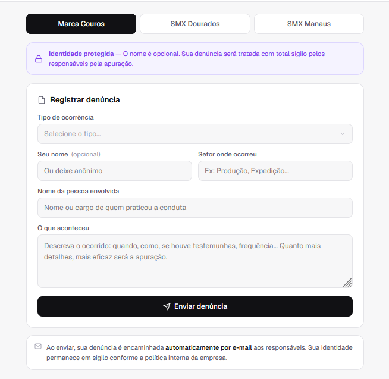

# 🛡️ Canal de Denúncias — Marca Couros / SMX

> Plataforma interna e confidencial para registro de denúncias de assédio e condutas inadequadas no ambiente de trabalho.

---

## ✨ Funcionalidades

- **Seleção de empresa** — Marca Couros, SMX Dourados e SMX Manaus
- **Categorias detalhadas** — Assédio moral, sexual, discriminação e outras ocorrências
- **Identidade protegida** — Nome do denunciante é opcional (envio anônimo)
- **Envio automático por e-mail** — Denúncia encaminhada instantaneamente aos responsáveis
- **Interface minimalista** — Layout limpo, compacto e responsivo
- **100% estático** — Apenas um arquivo HTML, sem banco de dados ou servidor

---

## 🖥️ Preview



---

## 🚀 Como usar

### 1. Clone ou baixe o repositório

```bash
git clone https://github.com/seu-usuario/canal-denuncias.git
```

### 2. Abra o `index.html` no navegador

Não precisa de servidor. Basta abrir o arquivo diretamente.

### 3. Configure o EmailJS

No arquivo `index.html`, localize o bloco de configuração e substitua com suas credenciais:

```js
const EMAILJS_PUBLIC_KEY  = "sua_public_key";
const EMAILJS_SERVICE_ID  = "seu_service_id";
const EMAILJS_TEMPLATE_ID = "seu_template_id";
```

> Veja a seção [Configuração do EmailJS](#-configuração-do-emailjs) abaixo.

---

## 📧 Configuração do EmailJS

O envio de emails é feito via [EmailJS](https://www.emailjs.com) — gratuito para até **200 envios/mês**.

### Passo a passo

1. Crie uma conta em [emailjs.com](https://www.emailjs.com)
2. Vá em **Email Services → Add New Service** e conecte um email (Outlook, Gmail etc.)
3. Vá em **Email Templates → Create New Template** com as seguintes variáveis:

| Variável | Descrição |
|---|---|
| `{{empresa}}` | Empresa selecionada |
| `{{tipo}}` | Categoria da ocorrência |
| `{{nome}}` | Nome do denunciante (ou "Anônimo") |
| `{{setor}}` | Setor onde ocorreu |
| `{{assediador}}` | Pessoa envolvida |
| `{{relato}}` | Descrição completa |
| `{{data_hora}}` | Data e hora do envio |

4. Copie o **Service ID**, **Template ID** e **Public Key** e cole no `index.html`

---

## 🌐 Hospedagem no GitHub Pages

1. Faça upload do `index.html` renomeado para `index.html` no repositório
2. Vá em **Settings → Pages**
3. Em **Branch**, selecione `main` e pasta `/ (root)`
4. Clique em **Save**

Seu canal estará disponível em:
```
https://seu-usuario.github.io/canal-denuncias
```

---

## 🗂️ Estrutura do projeto

```
canal-denuncias/
└── index.html   # Aplicação completa (HTML + CSS + JS em um único arquivo)
```

---

## 🔒 Privacidade e segurança

- O nome do denunciante é **completamente opcional**
- Nenhum dado é armazenado em banco de dados — tudo vai direto por email
- O código-fonte não contém informações sensíveis dos denunciantes
- Recomenda-se manter o repositório **privado** para proteger as credenciais do EmailJS

---

## 🛠️ Tecnologias

| Tecnologia | Uso |
|---|---|
| HTML / CSS / JavaScript | Interface e lógica |
| [EmailJS](https://emailjs.com) | Envio de emails sem backend |
| [Geist Font](https://vercel.com/font) | Tipografia |
| GitHub Pages | Hospedagem gratuita |

---

## 📄 Licença

Uso interno — Marca Couros / SMX. Todos os direitos reservados.
